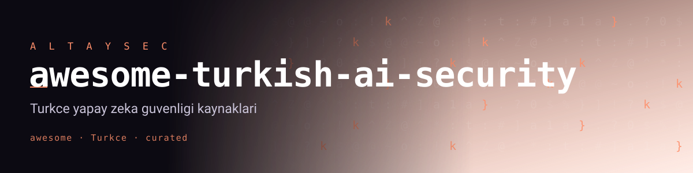

# awesome-turkish-ai-security

[-0A7BBB.svg)](https://genai.owasp.org/llm-top-10/)

> Türkçe ve Türkiye ekosistemi için **yapay zeka / büyük dil modeli (LLM) güvenliği** kaynaklarının kürasyonlu, doğrulanabilir listesi.
> _A curated, source-verified list of AI/LLM security resources for the Turkish language and ecosystem._

Yapay zeka artık Türkçe üreten, Türkçe komut alan ve Türkçe veriyle beslenen sistemlerde çalışıyor. Ancak saldırı yüzeyleri (prompt injection, veri sızıntısı, tedarik zinciri, aşırı yetki) çoğunlukla İngilizce literatürde tartışılıyor. Bu liste; **Türkçe rehberleri, araçları, veri setlerini, yerli modelleri, eğitimleri ve toplulukları** tek yerde toplar ve her girişi **OWASP LLM Top 10 (2025)** ile **MITRE ATLAS** gibi kabul görmüş çerçevelere bağlamayı hedefler.

---

## Doğrulama ve dürüstlük

- Bu liste **"ilk", "en iyi", "tek", "lider"** gibi iddialar içermez. Her giriş, ne olduğunu tarif eder; sıralama alfabetik/işlevseldir, kalite hiyerarşisi değildir.
- Standart adları ve numaralandırmalar resmi kaynaklardan alınmıştır: [OWASP Top 10 for LLM Applications 2025](https://genai.owasp.org/llm-top-10/) ve [MITRE ATLAS](https://atlas.mitre.org/).
- Girişler **Temmuz 2026** itibarıyla erişilebilir kaynaklara göre doğrulanmıştır. Bir bağlantı bozulur veya bir iddia yanlışsa, lütfen bir issue/PR açın.
- Bir başlığın altındaki kaynak sayısının az olması, o alanın Türkçe'de henüz olgunlaşmadığını gösterir — katkılara en çok orada ihtiyaç var.

## İçindekiler

- [Standartlar ve çerçeveler](#standartlar-ve-çerçeveler)
- [Türkçe rehberler ve makaleler](#türkçe-rehberler-ve-makaleler)
- [Araçlar](#araçlar)
- [Veri setleri](#veri-setleri)
- [Yerli modeller ve guardrail'ler](#yerli-modeller-ve-guardrailler)
- [Eğitim](#eğitim)
- [Topluluk ve etkinlikler](#topluluk-ve-etkinlikler)
- [Düzenleme ve uyum (KVKK)](#düzenleme-ve-uyum-kvkk)
- [İlgili listeler ve projeler](#ilgili-listeler-ve-projeler)
- [Katkı](#katkı)
- [Lisans](#lisans)

---

## Standartlar ve çerçeveler

Türkçe bir sistemi denetlerken de referans alınan, dile bağımsız temel çerçeveler.

- **[OWASP Top 10 for LLM Applications (2025)](https://genai.owasp.org/llm-top-10/)** — LLM uygulamaları için en kritik 10 risk. 2025 sürümü:
  - `LLM01` Prompt Injection · `LLM02` Sensitive Information Disclosure · `LLM03` Supply Chain · `LLM04` Data and Model Poisoning · `LLM05` Improper Output Handling · `LLM06` Excessive Agency · `LLM07` System Prompt Leakage · `LLM08` Vector and Embedding Weaknesses · `LLM09` Misinformation · `LLM10` Unbounded Consumption.
- **[MITRE ATLAS](https://atlas.mitre.org/)** — _Adversarial Threat Landscape for Artificial-Intelligence Systems._ YZ sistemlerine yönelik gerçek dünya taktik/teknik matrisi ve vaka çalışmaları (ATT&CK'in YZ karşılığı).
- **[OWASP GenAI Security Project](https://genai.owasp.org/)** — LLM Top 10'un yayımlandığı, açık katkıya dayalı üretken YZ güvenliği projesi. _(Bu listenin bakımcısı bu projeye kabul edilmiş bir katkı sunucusudur.)_
- **[NIST AI Risk Management Framework (AI RMF 1.0)](https://www.nist.gov/itl/ai-risk-management-framework)** — YZ risk yönetimi çerçevesi; üretken YZ için tamamlayıcı **Generative AI Profile (NIST AI 600-1)** dahil.

## Türkçe rehberler ve makaleler

Türkçe içerik ya da Türkçe/Türkiye bağlamına özel güvenlik materyalleri.

- **[prompt-injection-corpus](https://github.com/fevziegeyurtsevenler/prompt-injection-corpus)** — Çok dilli (Türkçe/İngilizce) prompt injection ve jailbreak tekniklerini savunmalarıyla eşleştiren, OWASP LLM Top 10 ve MITRE ATLAS'a haritalanmış açık katalog. _(Türkçe saldırı örnekleri içermesiyle bu alanda az sayıdaki kaynaktan biri.)_
- **[llm-security-skills](https://github.com/fevziegeyurtsevenler/llm-security-skills)** — Kodlama ajanlarını LLM güvenlik denetçisine dönüştüren Agent Skill seti; prompt-injection testi, OWASP LLM Top 10 denetimi, MCP ve RAG incelemesi — **Türkçe ve İngilizce** destekli.
- **[USOM / siberguvenlik.gov.tr](https://www.siberguvenlik.gov.tr/)** — Ulusal Siber Olaylara Müdahale Merkezi'nin Türkçe teknik bildirimleri, zararlı bağlantı listeleri ve CVE duyuruları (dosya paylaşımı API'ye taşınıyor).
- **[KVKK — Yapay Zeka ve Kişisel Veri Rehberi](https://www.kvkk.gov.tr/)** — Kişisel Verileri Koruma Kurumu'nun yapay zeka alanında kişisel verilerin korunmasına dair tavsiyeleri (Türkçe düzenleyici perspektif).

> Bu bölüm bilinçli olarak seçici tutulmuştur. Türkçe akademik makale, blog yazısı veya konuşma sunumu önermek isterseniz PR açın — hedef, doğrulanabilir ve konuya özel içerik.

## Araçlar

LLM/ajan güvenliği için kullanılabilir araçlar. Türkçe'yi doğrudan destekleyenler ayrıca işaretlenmiştir.

- **[uncloak](https://github.com/fevziegeyurtsevenler/uncloak)** 🇹🇷 — Sıfır bağımlılıklı, çok dilli tarayıcı; Agent Skill'lerde, MCP tanımlarında ve kural dosyalarında (`.cursorrules`, `CLAUDE.md`, `AGENTS.md`) **görünmez Unicode talimatlarını** ve tedarik zinciri risklerini bulur. Bulguları OWASP LLM Top 10 / MITRE ATLAS'a haritalar; terminal, JSON ve **SARIF** çıktısı verir.
- **[skills-in-the-wild](https://github.com/fevziegeyurtsevenler/skills-in-the-wild)** — 3.168 gerçek, kamuya açık YZ ajan uzantısı üzerinde yürütülmüş açık güvenlik denetimi; veri seti, bulgular ve tekrar üretilebilir metodoloji (uncloak ile).
- **[garak](https://github.com/NVIDIA/garak)** — LLM zafiyet tarayıcısı (prompt injection, veri sızıntısı, toksisite vb.). Türkçe payload'larla da çalıştırılabilir.
- **[Microsoft PyRIT](https://github.com/Azure/PyRIT)** — Üretken YZ için otomasyonlu kırmızı takım (risk identification) çerçevesi; çok dilli senaryolara uyarlanabilir.
- **[promptfoo](https://github.com/promptfoo/promptfoo)** — LLM çıktı değerlendirme ve red-team test koşucusu; Türkçe test setleriyle CI'a bağlanabilir.

## Veri setleri

Türkçe içeren veya Türkçe modellerin güvenlik değerlendirmesinde kullanılabilen açık veri setleri.

- **[prompt-injection-corpus](https://github.com/fevziegeyurtsevenler/prompt-injection-corpus)** 🇹🇷 — Türkçe/İngilizce prompt injection + jailbreak ↔ savunma çiftleri; OWASP/ATLAS etiketli.
- **[MLSUM (Türkçe)](https://huggingface.co/datasets/GEM/mlsum)** — Çok dilli özetleme veri seti; Türkçe alt kümesi, model çıktı/halüsinasyon değerlendirmesi için kullanılır.
- **[ytu-ce-cosmos veri setleri](https://huggingface.co/ytu-ce-cosmos)** — YTÜ Cosmos ekibinin guardrail, PII ve sınıflandırma odaklı Türkçe veri setleri (koleksiyonda 11 veri seti listeleniyor).

> Türkçe jailbreak/injection, toksisite veya PII değerlendirme veri seti biliyorsanız katkı çok değerli — bu, Türkçe YZ güvenliğinin en zayıf halkalarından biri.

## Yerli modeller ve guardrail'ler

Türkçe odaklı açık modeller. Güvenlik açısından ikili değeri var: (1) denetlenecek/kırılacak hedefler, (2) guardrail/PII gibi savunma bileşenleri.

- **[YTÜ Cosmos — ModernBERT-TR & 150M Türkçe encoder ailesi](https://huggingface.co/ytu-ce-cosmos)** — Yıldız Teknik Üniversitesi Bilgisayar Müh. araştırma grubu; **guardrail tespiti** ve **PII (kişisel veri) tespiti** dahil görev-özel Türkçe encoder'lar, `CosmosLLaMa` ve `CosmosGemma` üretken modelleri. _(Savunma tarafında en doğrudan kullanılabilir yerli bileşenler.)_
- **[VNGRS — Kumru-2B / Kumru-2B-Base](https://huggingface.co/vngrs-ai)** — 2 milyar parametreli, Türkçe odaklı üretken modeller; ayrıca VBART ailesi ve açık kaynak Türkçe NLP kütüphanesi VNLP.
- **[Trendyol LLM ailesi](https://huggingface.co/Trendyol)** — `Trendyol-LLM-8B-T1` gibi Türkçe/İngilizce modeller; ek olarak siber güvenlik/kırmızı takım odaklı `Trendyol-Cybersecurity-LLM` (Qwen3 tabanlı) ve `BaronLLM` gibi güvenlik-özel modeller.
- **[TURNA](https://huggingface.co/boun-tabi-LMG)** — Boğaziçi Üniversitesi TABILAB; 1.1B parametreli, T5 tabanlı (encoder-decoder) Türkçe dil modeli ve görev-özel varyantları.

> Not: Model sayfalarındaki "en iyi Türkçe model" gibi pazarlama ifadeleri geliştiricilerin kendi beyanıdır; bu liste bunları olgu olarak tekrarlamaz.

## Eğitim

Türkçe YZ/LLM güvenliği öğrenme kaynakları.

- **[llm-security-skills](https://github.com/fevziegeyurtsevenler/llm-security-skills)** 🇹🇷 — Uygulamalı OWASP LLM Top 10 denetimi, prompt-injection testi, MCP/RAG incelemesi için Türkçe+İngilizce Agent Skill'ler.
- **[OWASP GenAI Security Project — kaynaklar](https://genai.owasp.org/resources/)** — LLM Top 10, tehdit avı ve güvenli dağıtım rehberleri (İngilizce; Türkçe çeviri çalışmaları topluluk tarafından sürüyor).
- **[BTK Akademi](https://www.btkakademi.gov.tr/)** — Bilgi Teknolojileri ve İletişim Kurumu'nun ücretsiz Türkçe siber güvenlik ve yapay zeka kursları.
- **[MITRE ATLAS](https://atlas.mitre.org/)** — Gerçek YZ saldırılarının adım adım vaka analizleri; Türkçe senaryo tasarlarken sağlam bir referans.

## Topluluk ve etkinlikler

Türkiye'deki güvenlik ve YZ topluluk buluşmaları.

- ****NOPcon**** — İstanbul merkezli bağımsız hacker/güvenlik konferansı; teknik sunumlar ve topluluk odaklı içerik.
- **[OWASP Türkiye / İstanbul Chapter](https://owasp.org/chapters/)** — OWASP'ın yerel bölümü; uygulama ve YZ güvenliği etkinlikleri.
- **[BGA — Bilgi Güvenliği AKADEMİSİ](https://www.bgasecurity.com/)** — ISTSEC gibi Türkçe güvenlik konferans/etkinliklerinin ve eğitimlerinin düzenleyicisi.
- **Türkçe NLP/YZ toplulukları** — Yerli modelleri geliştiren ve tartışan aktif Hugging Face organizasyonları: [VNGRS](https://huggingface.co/vngrs-ai), [Boğaziçi TABILAB](https://huggingface.co/boun-tabi-LMG), [YTÜ Cosmos](https://huggingface.co/ytu-ce-cosmos).

> Etkinlik tarihleri yıldan yıla değişir; bu liste doğrulayamadığı belirli tarih/edisyon iddialarında bulunmaz. Güncel etkinlik bilgisi için ilgili resmi sayfaları takip edin.

## Düzenleme ve uyum (KVKK)

Türkiye'de YZ dağıtan sistemler için hukuki/uyum bağlamı.

- **[KVKK — Kişisel Verileri Koruma Kurumu](https://www.kvkk.gov.tr/)** — Kişisel verilerin işlenmesine dair ulusal otorite; yapay zeka ve kişisel veri koruma tavsiyeleri LLM'lerde `LLM02: Sensitive Information Disclosure` ile doğrudan ilişkilidir.
- **[siberguvenlik.gov.tr (USOM / Siber Güvenlik Başkanlığı)](https://www.siberguvenlik.gov.tr/)** — Ulusal siber güvenlik duyuruları, olay bildirimi ve teknik kaynaklar.

## İlgili listeler ve projeler

Bu listeyi tamamlayan, aynı bakımcının açık kaynak çalışmaları:

- **[awesome-agent-supply-chain-security](https://github.com/fevziegeyurtsevenler/awesome-agent-supply-chain-security)** — YZ ajan uzantıları (Skills, MCP sunucuları, eklentiler) için tedarik zinciri güvenliği araç/araştırma/standart derlemesi.
- **[uncloak](https://github.com/fevziegeyurtsevenler/uncloak)** · **[skills-in-the-wild](https://github.com/fevziegeyurtsevenler/skills-in-the-wild)** · **[llm-security-skills](https://github.com/fevziegeyurtsevenler/llm-security-skills)** · **[prompt-injection-corpus](https://github.com/fevziegeyurtsevenler/prompt-injection-corpus)** — çok dilli (Türkçe dahil) LLM/ajan güvenliği araç ve veri kümeleri.

## Katkı

Katkılar memnuniyetle karşılanır. Lütfen önce [CONTRIBUTING.md](CONTRIBUTING.md) dosyasını okuyun. Özet ölçütler:

- Giriş **gerçek ve erişilebilir** olmalı (çalışan bağlantı) ve **Türkçe/Türkiye YZ güvenliği** kapsamına girmeli.
- Açıklama **tarafsız** olsun: "en iyi/ilk/tek" gibi ispatlanamayan iddialardan kaçının.
- Mümkünse girişi bir OWASP LLM Top 10 (2025) maddesi veya MITRE ATLAS tekniğiyle ilişkilendirin.
- Ticari ürünler kabul edilir ancak **orantılı** biçimde ve açık işlevsel tanımla eklenir.

## Lisans

Bu çalışma [Creative Commons CC0 1.0 Universal](https://creativecommons.org/publicdomain/zero/1.0/) ile kamu malına ithaf edilmiştir. Yasaların izin verdiği ölçüde, bakımcı tüm telif haklarından feragat etmiştir. Serbestçe kopyalayın, değiştirin, dağıtın — atıf zorunlu değildir ama takdir edilir.

_Derleyen ve bakımını yapan: [Fevzi Ege Yurtsevenler](https://github.com/fevziegeyurtsevenler) — çok dilli LLM/YZ güvenliği araştırmacısı, OWASP GenAI Security Project katkı sunucusu._
